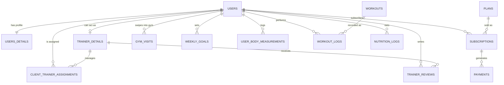

# Core Fitness Platform - Database Schema

## 📖 Overview

This repository contains the database architecture for a comprehensive fitness and gym management platform. The schema is designed to handle multiple user roles (Consumers, Trainers, Admins) and supports complex business logic including subscription billing, trainer matching, physical progress tracking, and gym attendance.

The design is optimized for a relational database system such as **PostgreSQL** or **MySQL**.

## 🏗️ Core Modules

The database is divided into several logical domains:

- **👥 User & Identity Management:** Core authentication, role separation, and detailed physical profiles/goals.
- **💳 Subscriptions & Billing:** Handles tiered plans (free, customized, group), active subscriptions, and payment histories.
- **🏋️‍♂️ Trainer Operations:** Manages trainer profiles, capacity limits, client-trainer assignments (many-to-many), and client reviews.
- **📈 Health & Workout Tracking:** Logs user body measurements, daily health metrics (steps, sleep, BP), workout sets/reps, and daily nutrition.
- **🚪 Gym Operations:** Tracks physical gym check-ins and check-outs to monitor peak hours and user consistency.

---

## 🗺️ Entity-Relationship Diagram (ERD)

The following diagram illustrates the high-level relationships between the core entities.

